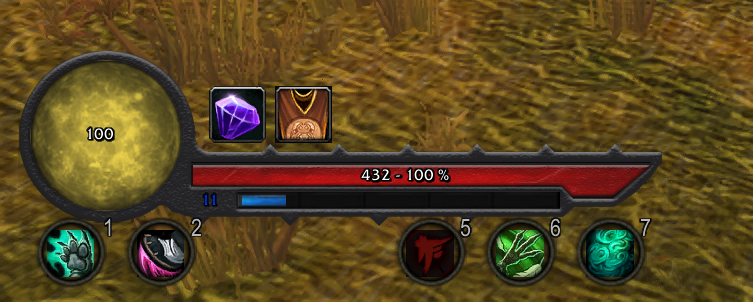

# wow_d3c_weakauras

V2 textures are the proper size to fit in the frame, but weakauras still wants things to be resized.  Though orb texture hasn't been modified. Reisze to your liking.  Frame texture now includes "spike" separators for abilities and buffs (if you want to recreate that console ui).  7 (de)buffs & abilities should fit on one line. 

<h2>To-do:</h2>

<ul>
  <li>Impliment tooltips for player & player xp</li>
  <li>Enable right click functionality on player frame(energy? Health? Can weakauras even do that?)</li>
  <li>Action bar 1 abilities 1-7 as part of frame (or leave everyone to use bartender?)</li>
  <li>Learn to display fonts better</li>
  <li>Maybe add a texture for frozen xp?</li>
  <li>Turn into standalone addon, free from weakauras.</li>
  <li>Get overwhelmed and give up before finishing standalone addon.</li>
</ul>

<h2>Questions</h2>

<ul>
  <li>Can weakauras take over buff display?</li>
  <li>Can weakauras show action bar elements, or do I need to hardcode <em>my</em> abilities?</li>
</ul>

